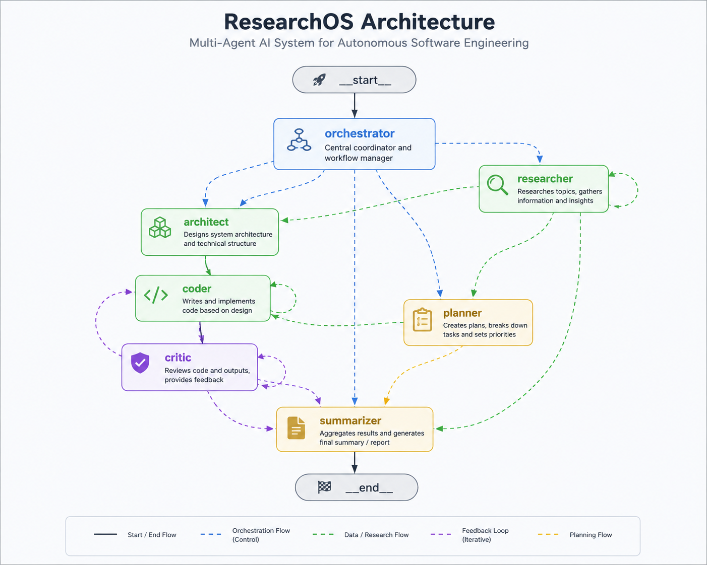

# ResearchOS

<div align="center">


**An autonomous multi-agent AI system that researches, designs, and writes production-ready code from a single prompt.**

[Getting Started](#getting-started) · [Architecture](docs/ARCHITECTURE.md) ·  [Docs](docs/)

</div>

---

## What it does

Give ResearchOS a goal. It spins up a team of specialized AI agents that collaborate to deliver a complete software project:

1. **Orchestrator** breaks your goal into ordered tasks
2. **Researcher** searches the web, arXiv, and GitHub for real, current information
3. **Architect** runs two competing models to propose a system design — a judge picks the stronger one
4. **Coder** generates each file from the winning architecture
5. **Critic** reviews every file (syntax check → import check → LLM quality review), sends failures back for revision
6. **Planner** (research-only goals) produces a concrete action plan instead of code

Generated files land directly in your working directory, ready to run.
---

## Graph-Architecture

<p align="center">
  
</p>

The following diagram illustrates the overall ResearchOS workflow, showing how the specialized agents collaborate, interact with MCP servers, communicate with LLM providers, and produce the final software project.


---

## Getting started

Two ways to run ResearchOS. Pick whichever suits you.

---

### Option A — Docker (recommended, no Python required)

Pull the pre-built image from the GitHub Container Registry and start everything with one command. Docker handles Python, dependencies, and the MCP servers automatically.

**1. Prerequisites**

- [Docker](https://docs.docker.com/get-docker/) and [Docker Compose](https://docs.docker.com/compose/install/)

```bash
docker --version
docker compose version
```

**2. Clone the repository**

```bash
git clone https://github.com/SangamSilwal/ResearchOS.git
cd ResearchOS
```

**3. Configure API keys**

```bash
cp .env.example .env
```

Open `.env` and fill in your keys. See [API Keys](#api-keys) below for where to get each one.

**4. Run**

```bash
docker compose up
```

Docker Compose pulls the latest image from `ghcr.io/sangamsilwal/researchos`, starts the Web Search and ArXiv MCP servers, and launches the agent workflow.

**Run a custom goal**

```bash
TASK="Build an AI chatbot using FastAPI and WebSockets" docker compose up
```

**Stop**

```bash
docker compose down
```

**Update to the latest image**

```bash
docker compose pull && docker compose up
```

---

### Option B — Run from source (requires Python 3.10+)

**1. Clone and install**

```bash
git clone https://github.com/SangamSilwal/ResearchOS.git
cd ResearchOS
python -m venv .venv
source .venv/bin/activate
pip install -e .
```

**2. Configure API keys**

```bash
cp .env.example .env
# Edit .env with your keys (see API Keys section below)
```

**3. Start the MCP servers** (two separate terminals)

```bash
# Terminal 1
python mcp_servers/web_search/server_web_search.py

# Terminal 2
python mcp_servers/arxiv_mcp/server_arxiv.py
```

**4. Run**

```bash
cd /path/to/your/project/folder
python /path/to/ResearchOS/run.py "Build a REST API with FastAPI and PostgreSQL"
```

Generated files are written into the directory you ran the command from.

---

## API keys

All keys go in your `.env` file. You only need the providers you intend to use — configure at least one LLM provider.

| Key | Where to get it | Required |
|-----|----------------|----------|
| `TAVILY_API_KEY` | [tavily.com](https://tavily.com) → Sign up → API Keys | Yes (web search) |
| `GITHUB_TOKEN` | [github.com/settings/tokens](https://github.com/settings/tokens) → Generate new token (fine-grained, read-only public repos) | Yes (GitHub repo search) |
| `GOOGLE_API_KEY` | [aistudio.google.com/apikey](https://aistudio.google.com/apikey) | If using Gemini models |
| `GROQ_API_KEY` | [console.groq.com/keys](https://console.groq.com/keys) | If using Groq models |
| `MISTRAL_API_KEY` | [console.mistral.ai/api-keys](https://console.mistral.ai/api-keys) | If using Mistral models |
| `OPENROUTER_API_KEY` | [openrouter.ai/keys](https://openrouter.ai/keys) | If using OpenRouter models |
| `LANGCHAIN_API_KEY` | [smith.langchain.com](https://smith.langchain.com) → Settings → API Keys | Optional (LangSmith tracing) |

---

## Configuring models

Open `core/config.py`. Each agent uses a separately configurable model so you can mix providers — for example, use a fast/cheap model for research and a stronger one for architecture decisions:

```python
# core/config.py

orchestrator_model  = "mistral/mistral-small"       # parses the goal into tasks
researcher_model    = "groq/llama-3.1-8b-instant"   # synthesizes research summaries
architect_model_a   = "mistral/mistral-small"        # first competing architecture proposal
architect_model_b   = "openrouter/nvidia/..."        # second competing proposal
architect_judge_model = "google/gemini-1.5-pro"     # picks the stronger design
coder_model         = "mistral/mistral-small"        # generates each file
critic_model        = "mistral/mistral-small"        # reviews each file
planner_model       = "mistral/mistral-small"        # research-only action plans
```

Model strings follow the format `provider/model-name` as defined in `llm/router.py`. Any provider you have an API key for is usable in any slot.

---

## Output

Generated projects are written to the directory you run ResearchOS from:

```
your-project-folder/
├── app/
│   ├── main.py
│   ├── database.py
│   ├── models.py
│   └── ...
├── requirements.txt
├── .env.example
└── ...
```

When using Docker, output goes into the `workspace/` directory inside the repo:

```
workspace/
└── project-<id>/
    ├── backend/
    ├── frontend/
    ├── docs/
    └── ...
```

---

## MCP servers

| Server | Port | Purpose |
|--------|------|---------|
| Web Search (Tavily) | 8000 | Internet search |
| ArXiv | 8001 | Academic paper retrieval |

Both start automatically under Docker. When running from source, start them manually (see Option B above).

---

## Project structure

```
ResearchOS/
├── agents/          # Orchestrator, Researcher, Architect, Coder, Critic, Planner
├── core/
│   ├── config.py    # Model configuration — edit this to change which models are used
│   └── memory.py    # Cross-run memory (SQLite by default)
├── llm/
│   └── router.py    # Maps model strings to LLM clients
├── mcp_servers/
│   ├── web_search/  # Tavily-backed web search MCP server
│   └── arxiv_mcp/   # ArXiv paper search MCP server
├── docs/            # Architecture docs and contributor guides
├── workspace/       # Generated project output (Docker mode)
├── run.py           # Direct runner (source mode)
├── graph.py         # LangGraph pipeline definition
├── docker-compose.yml
├── Dockerfile
├── requirements.txt
├── pyproject.toml
├── .env.example
└── README.md
```

---

## Documentation

The `docs/` folder contains everything contributors need:

| File | Contents |
|------|----------|
| [`docs/ARCHITECTURE.md`](docs/ARCHITECTURE.md) | Full system design — agent responsibilities, state schema, graph topology, known limitations and good first issues |
| [`docs/AGENTS.md`](docs/AGENTS.md) | Per-agent deep dive — system prompts, input/output contracts, extension points |
| [`docs/MCP_SERVERS.md`](docs/MCP_SERVERS.md) | How the MCP servers work, how to add a new one |
| [`docs/MODEL_CONFIGURATION.md`](docs/MODEL_CONFIGURATION.md) | All model config options, provider compatibility matrix |
| [`docs/CHANGELOG.md`](docs/CHANGELOG.md) | Version history and notable changes |

---

## Troubleshooting

**Docker permission denied**

```bash
sudo usermod -aG docker $USER
# Log out and log back in
```

**Missing API keys**

Check that all required keys are present in `.env`. The run will fail early with a clear message if a key is missing.

**`_unmatched/` files appearing**

These are a fallback when the architect's task list doesn't include an explicit `target_path` for a file — usually caused by a weaker/free-tier model not following the JSON schema precisely. Try using a larger model for `architect_model_a` / `architect_model_b` in `core/config.py`.

**Critic flags everything**

The most common cause is missing third-party packages — the architect's `dependencies` list was incomplete and pip couldn't install them before the import check ran. Check the flagged task's `critic_verdict` for `ModuleNotFoundError` details.

---

## License

GNU General Public License v3.0. See [`LICENSE`](LICENSE) for the full text.

---

## Author

**Sangam Silwal** · [github.com/SangamSilwal](https://github.com/SangamSilwal)