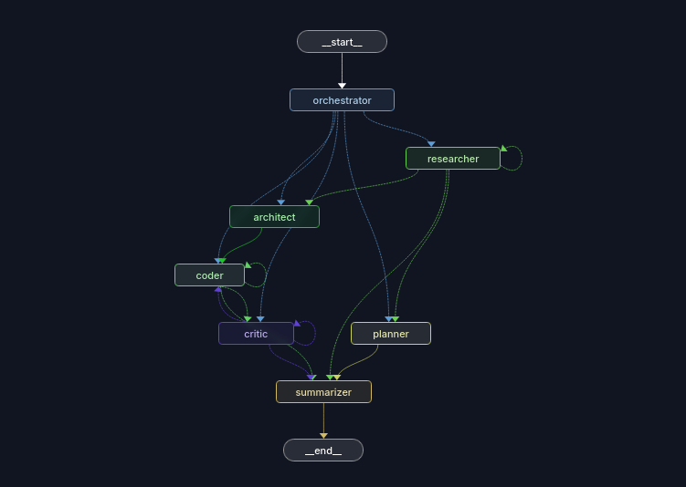

# ResearchOS Architecture

> **Who this is for:** Anyone who wants to understand how ResearchOS works — whether you're a first-time contributor, a developer curious about multi-agent systems, or someone evaluating the codebase. No prior knowledge of LangGraph or agent frameworks is assumed.

---

## The big picture

ResearchOS is a **multi-agent system**: instead of one large AI model doing everything, it uses a team of specialized agents, each with a narrow, well-defined job. They hand work to each other through a shared pipeline called a **graph**, coordinated by a framework called [LangGraph](https://github.com/langchain-ai/langgraph).

Think of it like a software engineering team:

| Agent | Analogy |
|---|---|
| Orchestrator | Project manager — receives the goal, creates the plan |
| Researcher | Analyst — gathers real-world information |
| Architect | System designer — decides what to build and how |
| Coder | Developer — writes the actual code |
| Critic | Code reviewer — checks quality, sends back for fixes |
| Planner | Strategist — creates a step-by-step roadmap (research-only goals) |
| Summarizer | Technical writer — produces the final summary/report |

The diagram below shows how they connect:



---

## Core concepts before diving in

Before reading the agent-by-agent breakdown, three concepts make everything else easier to understand.

### 1. State — the shared memory

All agents in ResearchOS share a single Python dictionary called **`ResearchState`**. Every agent reads from it, does its job, and writes its output back to it. No agent talks directly to another agent — they communicate entirely through this shared state.

Think of state as a project folder that every team member can read and write:

```python
ResearchState = {
    "goal":                 "Build a REST API with FastAPI",  # what the user asked for
    "tasks":                [...],   # list of jobs, each tagged with which agent should do it
    "messages":             [...],   # running log of what each agent said/did
    "research_findings":    [...],   # summaries produced by the Researcher
    "architecture_design":  {...},   # the winning design produced by the Architect
    "output":               {...},   # final outputs (plan, summary, etc.)
    "next_agent":           "coder", # who runs next — each agent sets this
    "project_id":           "...",   # unique ID for this run
}
```

The most important field is **`next_agent`**. Every agent, when it finishes its work, writes the name of the next agent into `next_agent`. The graph reads this and decides where to route execution. This is how agents "talk" to each other — not by calling each other directly, but by leaving instructions in shared state.

### 2. The graph — the traffic system

LangGraph turns the agent pipeline into a **graph** (in the computer-science sense: nodes connected by edges). Each agent is a **node**; the connections between them are **edges**.

There are two kinds of edges:

- **Fixed edges**: always go from A to B (e.g. after Architect, always go to Coder).
- **Conditional edges**: read `next_agent` from state and route accordingly (e.g. after Researcher, go to Architect if there's code to write, or go to Planner if it's a research-only goal).

This means the graph can loop (Coder → Critic → Coder → Critic → ...) and branch (Researcher → Architect *or* Researcher → Planner) without any explicit if/else logic scattered across the codebase. The routing rules live in one place in `graph.py`.

### 3. Tasks — the work queue

The Orchestrator populates `state["tasks"]` with a list of jobs, each tagged with which agent should handle it:

```python
{
    "id":          "task_1",
    "title":       "Research FastAPI best practices",
    "description": "Find current recommendations for structuring a production FastAPI app",
    "agent":       "researcher",   # who should do this
    "status":      "pending",      # pending → done (or coded → done via critic)
}
```

Each agent looks through the task list, picks up the first task tagged for it with `status == "pending"`, does the work, marks it `done`, and sets `next_agent` to either itself (loop — more tasks remaining) or the next stage (move on).

---

## The two pipelines

ResearchOS handles two fundamentally different kinds of goals. The Orchestrator decides which pipeline to use:

### Build pipeline — "build me something"

For goals like *"Build a REST API with FastAPI and PostgreSQL"*:

```
Start
  └─► Orchestrator
        └─► Researcher (loops until all research tasks done)
              └─► Architect (designs the system)
                    └─► Coder (writes each file)
                          └─► Critic (reviews each file)
                                ├─► Coder (if review failed — retry up to 3x)
                                └─► Summarizer → End
```

### Research pipeline — "tell me about something"

For goals like *"What's the best approach to rate-limiting a public API?"*:

```
Start
  └─► Orchestrator
        └─► Researcher (loops until all research tasks done)
              └─► Planner (produces a step-by-step action plan)
                    └─► Summarizer → End
```

The fork between these two pipelines happens inside `ResearcherAgent` — once all research tasks are done, it checks whether the task list contains an `"architect"`-tagged task (build goal) or a `"planner"`-tagged task (research goal) and sets `next_agent` accordingly.

---

## Agent-by-agent breakdown

### Orchestrator

**File:** `agents/orchestrator.py`

**Job:** Receives the user's raw goal. Calls the LLM once to produce a structured task breakdown. Populates `state["tasks"]` and sets `state["next_agent"]` to whichever agent should run first (almost always `"researcher"`).

**What it produces:**

```python
{
  "summary": "Build a production-ready REST API with user auth",
  "tasks": [
    {"id": "task_1", "title": "Research FastAPI best practices", "agent": "researcher"},
    {"id": "task_2", "title": "Design the system architecture", "agent": "architect"},
    # Note: never creates "coder" tasks directly — Architect does that
  ],
  "first_agent": "researcher"
}
```

**Key rule:** The Orchestrator never creates `coder` or `critic` tasks. The Architect creates coder tasks from its winning design; the Critic fires automatically after every coder task. The Orchestrator also never creates both an `architect` task and a `planner` task — these are mutually exclusive, signaling which pipeline this goal belongs to.

**Communicates with:** Sets `next_agent = "researcher"` (or whichever `first_agent` the LLM chose). The graph routes accordingly.

---

### Researcher

**File:** `agents/researcher.py`

**Job:** Takes one pending researcher task at a time. Queries three sources concurrently — web, arXiv, and GitHub — synthesizes a grounded summary from the combined results, and writes it to `state["research_findings"]`.

**Three data sources, running in parallel:**

```
Researcher task
  ├─► web_search MCP server (port 8000) ──────┐
  ├─► arxiv_search MCP server (port 8001) ────┼─► LLM synthesizes all three
  └─► GitHub official MCP server (remote) ────┘     into one research summary
```

The MCP (Model Context Protocol) servers are small HTTP services. The Researcher sends a query, gets results back. All three return their data in the same envelope format (`[{"type": "text", "text": "<json>"}]`) which the Researcher unpacks before processing.

**After each task:**

```python
# Still more researcher tasks pending?
next_agent = "researcher"   # loop — handle the next one

# All researcher tasks done — what's next?
if has pending "architect" task:
    next_agent = "architect"   # build pipeline
elif has pending "planner" task:
    next_agent = "planner"     # research pipeline
else:
    next_agent = "done"
```

**Communicates with:** MCP servers (via HTTP), then sets `next_agent` to route to Architect or Planner.

---

### Architect

**File:** `agents/architect_agent.py` — exposed as `architect_node(state)`

**Job:** Takes all the research findings and designs the full system. Uniquely, it does this as a **competition between two models** — the stronger design wins.

**How the competition works:**

```
Research findings → Proposer A (model_a) ──┐
                 → Proposer B (model_b) ──┼─► Judge (judge_model)
                                           │       picks the winner
                                           │       with written justification
                                           └──────────────────────────────►
                                                   Winning design →
                                                   implementation_tasks →
                                                   new "coder" tasks added
                                                   to state["tasks"]
```

Both proposers run **simultaneously** (via `asyncio.gather`) so there's no extra waiting — the total time is roughly one model call, not two.

**What the winning design contains:**

```python
{
    "rationale":     "Why these choices, connected to research findings",
    "components":    [{"name": "...", "responsibility": "...", "interacts_with": [...]}],
    "file_structure":[{"path": "app/main.py", "purpose": "FastAPI entrypoint"}],
    "decisions":     [{"decision": "Use async SQLAlchemy", "justification": "..."}],
    "risks":         ["Connection pool exhaustion under high load", ...],
    "dependencies":  ["fastapi", "sqlalchemy", "alembic", "pydantic-settings"],
    "implementation_tasks": [
        {"title": "Implement database module", "description": "...", "target_path": "app/database.py"},
        # one task per file — each has an explicit target_path
    ]
}
```

The `target_path` on each `implementation_task` is critical — it tells the Coder exactly which file to write, eliminating any guesswork about where the output should go.

**Communicates with:** Adds new `"coder"`-tagged tasks to `state["tasks"]`. Sets `next_agent = "coder"`. The graph then routes to the Coder node via a fixed edge (Architect always goes to Coder).

---

### Coder

**File:** `agents/coder_agent.py`

**Job:** Takes one pending coder task at a time. Generates the complete content for exactly one file. Writes it to disk at the path specified by `task["target_path"]`.

**What happens on each call:**

```
Pick first task where agent="coder" and status="pending"
  │
  ├─► Resolve the output path (cwd + target_path, with path traversal protection)
  ├─► Read existing file content (if the file already exists — merge, don't clobber)
  ├─► If this is a retry: include critic's revision_feedback in the prompt
  ├─► Call the LLM with: rationale + file structure + decisions + task description
  ├─► Strip any markdown code fences the model added despite instructions
  └─► Write the file to disk
       └─► Mark task status = "coded" (not "done" — critic decides "done")
            └─► next_agent = "critic"
```

**One important distinction:** The Coder marks its task `"coded"`, not `"done"`. `"Done"` is the Critic's call. This distinction is enforced by the status field — the Critic only picks up tasks with `status == "coded"`.

**On revision (retry):** When the Critic rejects a file and sends it back, the task arrives with `revision_feedback` attached. The Coder reads this and addresses the specific issues in its rewrite — it's not a blind retry.

**Communicates with:** Writes files to disk. Sets `next_agent = "critic"` after every successful write.

---

### Critic

**File:** `agents/critic_agent.py`

**Job:** Reviews one `"coded"` task at a time. Uses a two-stage approach: deterministic checks first (cheap, fast, no LLM cost), then LLM quality review only if those pass.

**Two-stage review:**

```
Stage 1 — Execution checks (deterministic, subprocess-isolated)
  ├─► Syntax check: python -m py_compile <file>
  │     └─► Failure? Send back to Coder with the exact error. Skip Stage 2.
  └─► Import check: actually imports the file using the project's own venv
        └─► Uses project root on sys.path (so "from app.models import User" works)
        └─► Failure? Send back to Coder with the exact ModuleNotFoundError.

Stage 2 — LLM quality review (only reached if Stage 1 passes)
  └─► Does the file actually fulfill the task description?
  └─► Logic errors, missing edge cases, obvious bugs?
  └─► Security issues (SQL injection, hardcoded secrets)?
  └─► Clean, idiomatic code for its language?
```

**The retry loop:**

```
Review result
  ├─► PASS → task status = "done" → next_agent = "coder" (next pending task)
  │                                               or "done" (no more tasks)
  ├─► FAIL (attempt 1 or 2) → attach revision_feedback to task
  │                         → task status = "pending" again
  │                         → next_agent = "coder" (retry this specific task)
  └─► FAIL (attempt 3) → task status = "flagged"
                       → human review needed
                       → move on to the next task
```

The retry cap of 3 is intentional — some failures (like a missing external dependency that pip can't install) can't be fixed by rewriting the code. Flagging for human review instead of looping forever prevents an infinite cycle.

**Per-project virtual environment:** The import check runs using the project's own `.venv`, not the ResearchOS tool's environment. Before running checks, the Critic installs the architect's declared `dependencies` into that venv, plus any additional imports it detects in the file via static analysis. This means a generated file importing `fastapi` or `sqlalchemy` actually gets those packages installed before the check runs.

**Communicates with:** Sets `next_agent = "coder"` (for retries or to move to the next pending task) or `"done"` (all tasks complete).

---

### Planner

**File:** `agents/planner_agent.py`

**Job:** Runs on research-only goals instead of the Architect/Coder/Critic pipeline. Takes all research findings and produces a concrete, ordered, step-by-step action plan for the user — not code, but "here is exactly what to do."

**What it produces:**

```python
{
    "summary": "A plan for implementing rate limiting on a public API",
    "steps": [
        {
            "step_number": 1,
            "title": "Choose a rate limiting strategy",
            "description": "Based on the research, token bucket is recommended for...",
            "based_on": "Research finding: 'Token bucket allows burst traffic while...'"
        },
        # each step explicitly cites which research finding it draws from
    ],
    "open_questions": [
        "The research didn't cover distributed rate limiting — needs further investigation"
    ]
}
```

**Communicates with:** Stores the plan in `state["output"]["plan"]`. Sets `next_agent = "summarizer"`.

---

### Summarizer

**File:** `agents/summarizer_agent.py`

**Job:** Runs at the very end of every pipeline — both build and research-only. Aggregates everything that happened across the run into a final human-readable summary/report: what was researched, what was designed, what was built, what failed, what was learned.

**What it receives:**

```python
# From the whole run's accumulated state:
state["research_findings"]    # everything the Researcher found
state["architecture_design"]  # the winning design (build goals)
state["architecture_competition"]  # both proposals + judge verdict
state["tasks"]                # full task list with final statuses
state["output"]               # plan (research goals) or other outputs
```

**What it produces:** A structured final report stored in `state["output"]["summary"]` and persisted to `core/memory.py` (SQLite) for future runs to reference as cross-run context.

**Communicates with:** Sets `next_agent = "done"`. The graph routes to `END`.

---

## Flow type legend

Referencing the diagram's five flow types:

| Color | Type | Meaning |
|---|---|---|
| Black solid | Start/End Flow | Entry (`__start__`) and exit (`__end__`) of the graph |
| Blue dashed | Orchestration Flow | Orchestrator delegating to agents — control decisions |
| Green dashed | Data/Research Flow | Research findings flowing between agents |
| Purple dashed | Feedback Loop | Critic sending work back to Coder for revision |
| Gold dashed | Planning Flow | Planner and Summarizer producing final outputs |

---

## How a complete run flows

Here is a concrete walk-through of a build goal — *"Build a REST API with FastAPI and PostgreSQL"* — tracing each state change:

```
1. User submits goal
   state["goal"] = "Build a REST API with FastAPI and PostgreSQL"

2. Orchestrator runs
   state["tasks"] = [
     {id: "t1", agent: "researcher", title: "Research FastAPI best practices", status: "pending"},
     {id: "t2", agent: "researcher", title: "Research PostgreSQL integration", status: "pending"},
     {id: "t3", agent: "architect",  title: "Design the system", status: "pending"},
   ]
   state["next_agent"] = "researcher"

3. Researcher runs (task t1)
   → queries web + arXiv + GitHub for "FastAPI best practices"
   → synthesizes a grounded summary
   state["research_findings"] += [{"task_title": "Research FastAPI...", "summary": "..."}]
   state["tasks"][0]["status"] = "done"
   state["next_agent"] = "researcher"  ← still more research tasks

4. Researcher runs (task t2)
   → queries for "PostgreSQL integration"
   state["research_findings"] += [{"task_title": "Research PostgreSQL...", "summary": "..."}]
   state["tasks"][1]["status"] = "done"
   → checks: is there a pending architect task? YES
   state["next_agent"] = "architect"

5. Architect runs
   → Proposer A and Proposer B each generate a complete design in parallel
   → Judge scores both, picks winner (say, Design B)
   state["architecture_design"] = { ...Design B... }
   state["architecture_competition"] = { design_a: ..., design_b: ..., winner: "B" }
   state["tasks"] += [
     {id: "t4", agent: "coder", title: "Implement app/main.py",     target_path: "app/main.py",     status: "pending"},
     {id: "t5", agent: "coder", title: "Implement app/database.py", target_path: "app/database.py", status: "pending"},
     ... (one task per file in the winning design)
   ]
   state["next_agent"] = "coder"

6. Coder runs (task t4 — app/main.py)
   → generates file content
   → writes app/main.py to disk
   state["tasks"][3]["status"] = "coded"
   state["tasks"][3]["output_path"] = "/path/to/project/app/main.py"
   state["next_agent"] = "critic"

7. Critic runs (task t4)
   Stage 1: syntax check → PASS
   Stage 1: import check → FAIL (ModuleNotFoundError: fastapi not installed)
   → installs fastapi into project venv
   → re-runs import check → PASS
   Stage 2: LLM review → PASS
   state["tasks"][3]["status"] = "done"
   state["next_agent"] = "coder"  ← next pending coder task

8. Coder runs (task t5 — app/database.py)
   ... (repeat for each file)

9. [If a file fails critic 3 times]
   state["tasks"][N]["status"] = "flagged"
   state["tasks"][N]["critic_verdict"] = { issues: [...], feedback: "..." }
   → move on to the next task

10. All coder tasks done (either "done" or "flagged")
    state["next_agent"] = "summarizer"

11. Summarizer runs
    → reads all research findings, architecture design, task outcomes
    → produces a final report
    state["output"]["summary"] = "..."
    → persists run to memory.sqlite
    state["next_agent"] = "done"

12. Graph reaches __end__
```

---

## Key design decisions

**Why a competition between two architects?**
A single model's design quality varies significantly by topic and by how research findings are framed. Two independent proposals plus a judging step consistently surfaces more specific risks, more granular file structures, and better-grounded decisions than either proposer alone. The judge's written justification (visible in `state["architecture_competition"]["verdict"]`) makes the reasoning transparent.

**Why does Critic have a retry cap?**
Some failures can't be fixed by rewriting the file — a missing external service, a dependency the architect omitted from its list, a task description that's genuinely ambiguous. A retry cap of 3 prevents an infinite loop while giving the model enough attempts to address fixable issues like syntax errors or import order problems.

**Why does each coder task have an explicit `target_path`?**
An earlier version guessed the file path from the task's title/description using text matching. This failed constantly — "Implement database session management" has no obvious lexical connection to `app/database.py`. Explicit `target_path` fields in the architect's schema make the connection unambiguous and eliminate an entire class of failures.

**Why run execution checks in a subprocess?**
The import check actually executes the generated file's module-level code. Running this in the main process would mean a badly generated file (one that, say, connects to a database at import time) could affect the whole ResearchOS process. A subprocess with a timeout isolates the risk.

**Why does the Critic use the project's own venv?**
Generated projects have their own dependencies (fastapi, sqlalchemy, etc.) that are separate from ResearchOS's own dependencies. Running the import check against ResearchOS's venv would either fail (the dependencies aren't there) or pollute it with the generated project's packages. A per-project venv in `.venv/` keeps them cleanly separated.

---

## Adding a new agent

If you want to extend ResearchOS with a new agent (say, a `tester` that generates and runs unit tests):

1. **Create `agents/tester_agent.py`** — extend `BaseAgent`, implement `system_prompt()` and `run(state)`. Pick up tasks tagged `"tester"` from `state["tasks"]`, return a state update with `next_agent` set.

2. **Add it to `graph.py`** — create a node, add it to `build_graph()`, wire the edges. Decide which existing node routes to it (probably Critic, after a file passes review) and what it routes to when done.

3. **Tell the Orchestrator it exists** — add `"tester"` to the agent list in `OrchestratorAgent.system_prompt()` with a description of when to use it.

4. **Update `ResearchState`** in `agents/state.py` if the agent needs to store new fields in shared state.

The key constraint: every agent's `run()` must return a dict of state fields to update, and must always set `next_agent`. If it doesn't, the graph has no routing instruction and will error.

---

## File map

```
ResearchOS/
├── agents/
│   ├── state.py             # ResearchState TypedDict — the shared memory
│   ├── base_agent.py        # BaseAgent ABC — build_messages(), LLM setup
│   ├── orchestrator.py      # OrchestratorAgent
│   ├── researcher.py        # ResearcherAgent (MCP tool calls, source filtering)
│   ├── architect_agent.py   # ArchitectProposer, ArchitectJudge, architect_node
│   ├── coder_agent.py       # CoderAgent (file writing, merge-on-existing)
│   ├── critic_agent.py      # CriticAgent (execution checks + LLM review)
│   ├── planner_agent.py     # PlannerAgent (research-only goals)
│   ├── summarizer_agent.py  # SummarizerAgent (final report)
│   ├── code_checks.py       # Sandboxed syntax + import checks
│   ├── project_venv.py      # Per-project venv management
│   └── workspace_safety.py  # Pre-run cwd safety check
├── core/
│   ├── config.py            # Model configuration — edit to change which models are used
│   └── memory.py            # Cross-run memory (SQLite / Postgres)
├── llm/
│   └── router.py            # Maps "provider/model-name" strings to LLM clients
├── mcp_servers/
│   ├── web_search/          # Tavily-powered web search MCP server
│   └── arxiv_mcp/           # ArXiv paper search MCP server
├── graph.py                 # LangGraph graph definition — nodes, edges, routing
└── run.py                   # Direct runner for source-mode use
```